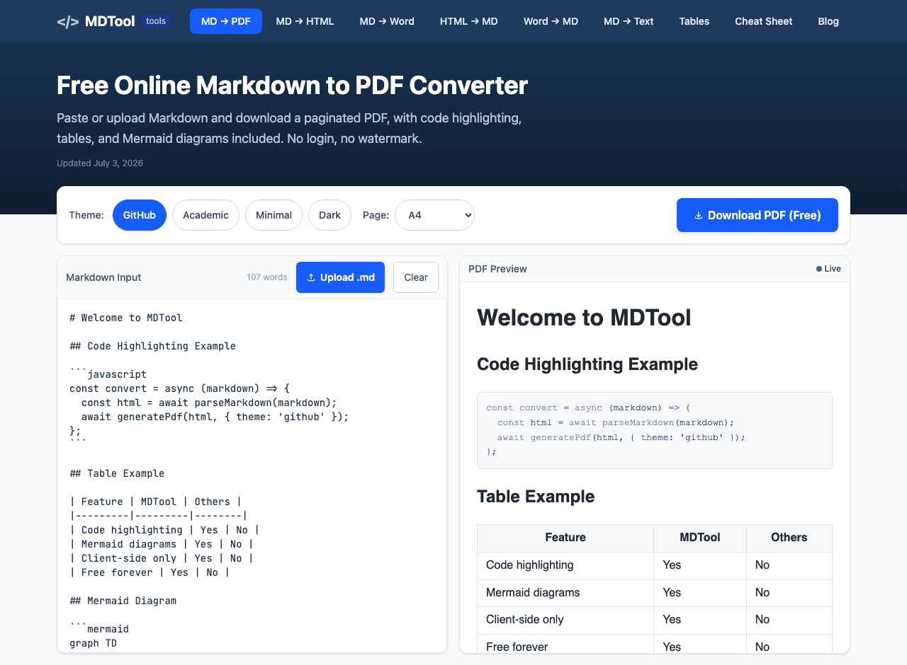

<div align="center">

<a href="https://www.mdtool.dev"></a>

# MDTool: Free Online Markdown Converter

**Convert Markdown to PDF, HTML, Word and plain text (and back), 100% in your browser.**

### [🚀 Open MDTool at mdtool.dev](https://www.mdtool.dev)

No signup · No watermarks · No file uploads. Your documents never leave your device.

[](https://www.mdtool.dev)
[](https://github.com/usmankhan045/mdtool/stargazers)
[](LICENSE)
[](https://nextjs.org)
[](https://react.dev)
[](https://www.mdtool.dev/about)

<a href="https://www.mdtool.dev/markdown-to-pdf"></a>

</div>

**MDTool** (also written *MD Tool*, at [mdtool.dev](https://www.mdtool.dev)) is a free, open-source (MIT), browser-based Markdown converter built by [Muhammad Usman](https://www.mdtool.dev/about#author). If you find it useful, a ⭐ on this repo helps other people find it.

---

## The Tools

| Converter | Try it | What you get |
|-----------|--------|--------------|
| **Markdown to PDF** | [mdtool.dev/markdown-to-pdf](https://www.mdtool.dev/markdown-to-pdf) | True **vector PDF** (selectable, searchable text, not a screenshot), 4 themes, syntax-highlighted code, GFM tables, **rendered Mermaid diagrams** |
| **Markdown to HTML** | [mdtool.dev/markdown-to-html](https://www.mdtool.dev/markdown-to-html) | Clean semantic HTML, snippet or full-document output, highlight.js classes baked in |
| **Markdown to Word** | [mdtool.dev/markdown-to-word](https://www.mdtool.dev/markdown-to-word) | A **real OOXML `.docx`** (not HTML in a shim). Opens correctly in Word, Google Docs, LibreOffice, Pages |
| **HTML to Markdown** | [mdtool.dev/html-to-markdown](https://www.mdtool.dev/html-to-markdown) | Clean GitHub Flavored Markdown, even from messy Word/Google-Docs HTML |
| **Word to Markdown** | [mdtool.dev/word-to-markdown](https://www.mdtool.dev/word-to-markdown) | Upload `.docx`, get clean Markdown. Headings, tables, and lists convert automatically |
| **Markdown to Plain Text** | [mdtool.dev/markdown-to-text](https://www.mdtool.dev/markdown-to-text) | Strips `#`, `**` and link syntax while keeping paragraphs, lists and table rows. Copy or download `.txt` |
| **Markdown Table Generator** | [mdtool.dev/markdown-table-generator](https://www.mdtool.dev/markdown-table-generator) | Visual grid editor with column alignment and **paste-from-Excel/Sheets import**. Copy as Markdown or HTML |

Plus a complete **[Markdown Cheat Sheet](https://www.mdtool.dev/markdown-cheat-sheet)**: every syntax element with copyable examples and a deep-dive guide per element (tables, checkboxes, code blocks, line breaks, and more).

## Why MDTool?

- 🔒 **Private by design**: every conversion runs client-side in your browser. Open DevTools' Network tab while converting: zero outbound requests carry your content. Safe for resumes, internal docs, and proprietary code.
- ⚡ **Instant**: no upload/download round-trip, no queue, no server.
- 🆓 **Actually free**: no account, no trial, no watermark, no file size limit.
- 📄 **Vector PDFs**: built with `pdfmake`, so PDF text stays selectable and searchable (most browser converters rasterize your document into blurry images).
- 📝 **Real Word files**: the `.docx` is genuine Office Open XML built from the Markdown AST, not an HTML `altChunk` hack that only renders in Microsoft Word.
- 🧜 **Mermaid support**: ` ```mermaid ` blocks render to SVG and land in your PDF exactly as previewed.

> **Naming note:** MDTool (mdtool.dev) is a Markdown document converter. It's unrelated to MonoDevelop's `mdtool` CLI or the SolidWorks "MDTools" add-in.

## How It Works

Each tool pairs a server-rendered SEO page with a client-only converter. All conversion logic lives in `lib/` as pure, framework-agnostic functions:

```
Markdown ──marked──▶ tokens/HTML ──┬─▶ pdfmake + html-to-pdfmake ──▶ vector PDF
                                   ├─▶ docx (OOXML AST builder)   ──▶ real .docx
                                   └─▶ semantic HTML + highlight.js
HTML/.docx ──mammoth──▶ HTML ──turndown + GFM plugin──▶ clean Markdown
```

- **`lib/markdown.ts`**: Markdown → HTML with a curated highlight.js language set (JS/TS, Python, Bash, Rust, Go, SQL, YAML, …)
- **`lib/pdf.ts`**: four PDF themes (GitHub, Academic, Minimal, Dark) driving pdfmake; vector text, not screenshots
- **`lib/docx.ts`**: walks marked's token AST to build a real Word document tree
- **`lib/htmlToMarkdown.ts`**: turndown with custom rules that fix invalid GFM tables from Word/Google-Docs paste and preserve code-block language hints
- **`lib/mermaid.ts`**: lazy-loads Mermaid and renders fenced diagram blocks to SVG

Browser-only libraries (`pdfmake`, `mammoth`, `mermaid`) are dynamically imported inside their functions, so nothing heavy loads until you actually convert, and the server build never touches them.

## Tech Stack

**[Next.js 16](https://nextjs.org)** (App Router) · **React 19** · **TypeScript** · **Tailwind CSS v4** · MDX blog (`next-mdx-remote`) · deployed on **Vercel**

Conversion engines: [`marked`](https://github.com/markedjs/marked) · [`turndown`](https://github.com/mixmark-io/turndown) (+ GFM plugin) · [`docx`](https://github.com/dolanmiu/docx) · [`mammoth`](https://github.com/mwilliamson/mammoth.js) · [`pdfmake`](https://github.com/bpampuch/pdfmake) · [`mermaid`](https://github.com/mermaid-js/mermaid) · [`highlight.js`](https://github.com/highlightjs/highlight.js)

## Project Structure

```
app/                       # Next.js App Router
├── markdown-to-pdf/       # Tool pages: server page.tsx (SEO) + ToolClient.tsx (interactive)
├── markdown-to-html/      #   … same pattern for every converter
├── markdown-cheat-sheet/  # Syntax reference hub + per-element guide pages
├── blog/                  # MDX blog: index + [slug] pages
├── sitemap.ts robots.ts   # Dynamic sitemap + robots (AI crawlers explicitly welcomed)
components/
├── tools/                 # Editors, previews, download buttons
├── seo/                   # StructuredData (JSON-LD), FaqSection
lib/                       # Pure conversion logic (framework-agnostic)
content/blog/              # MDX articles
public/llms.txt            # AI-agent site guide
```

## Run It Locally

```bash
git clone https://github.com/usmankhan045/mdtool.git
cd mdtool
npm install
npm run dev        # → http://localhost:3000
```

| Command | Description |
|---------|-------------|
| `npm run dev` | Start the dev server |
| `npm run build` | Production build |
| `npm run start` | Serve the production build |
| `npm run indexnow` | Ping search engines with sitemap URLs after deploy |

## Guides & Reference

The [MDTool blog](https://www.mdtool.dev/blog) covers the practical corners of document conversion:

- [Best Markdown to PDF Converter (2026 comparison)](https://www.mdtool.dev/blog/best-markdown-to-pdf-converter)
- [GitHub README to PDF without losing badges and code blocks](https://www.mdtool.dev/blog/github-readme-to-pdf)
- [Why Markdown tables break in PDF exports](https://www.mdtool.dev/blog/markdown-table-pdf)
- [Converting Word docs to Markdown for Obsidian](https://www.mdtool.dev/blog/word-to-markdown-obsidian)
- [HTML to Markdown for CMS migrations](https://www.mdtool.dev/blog/html-to-markdown-cms-migration)
- [Full Markdown Cheat Sheet](https://www.mdtool.dev/markdown-cheat-sheet)

## Author

Built and maintained by **[Muhammad Usman](https://github.com/usmankhan045)** ([about the project](https://www.mdtool.dev/about)).

Found a conversion bug? [Open an issue](https://github.com/usmankhan045/mdtool/issues). Real-world documents that break are the most valuable test cases.

## License

[MIT](LICENSE) © 2026 Muhammad Usman. The code is free to use, modify and redistribute. The MDTool name, logo and mdtool.dev domain are not covered by the license.

---

<div align="center">

**[Convert your first document free → mdtool.dev](https://www.mdtool.dev)**

*Fast, private, and free. No tracking of your content, no uploads, no login.*

</div>
