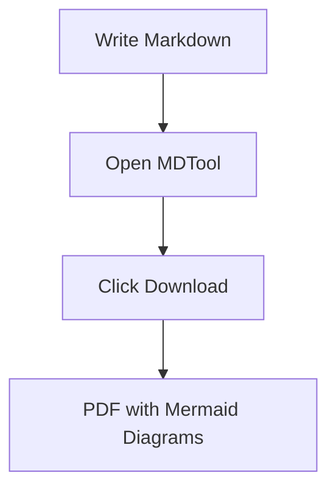

## Finding the Best Markdown to PDF Converter

If you've spent ten minutes searching for the best Markdown to PDF converter, you've already noticed the problem: every tool claims to "fully support Markdown," but the results tell a different story. Code blocks lose syntax highlighting. Tables get mangled. Mermaid diagrams just vanish. And half the tools require you to create an account before you can download a single file.

This guide cuts through the noise. We tested five tools against the same Markdown document — one that includes fenced code blocks, a Mermaid flowchart, a table, and custom heading styles — and reported exactly what each tool did with it.

---

## The Contenders

### <a href="https://www.markdowntopdf.com" rel="nofollow noopener" target="_blank">markdowntopdf.com</a>

One of the oldest tools in this category. It parses basic Markdown reliably — headings, bold, italic, lists — but code blocks are rendered without syntax highlighting and without a monospace font on some themes. There's no Mermaid support, and the output styling is fixed: you can't choose a theme or adjust margins. No login required, and the conversion is server-side (your Markdown is uploaded and processed remotely).

### <a href="https://dillinger.io" rel="nofollow noopener" target="_blank">Dillinger</a>

Dillinger is primarily a Markdown editor with a live HTML preview. The "Export as PDF" feature effectively prints the preview pane using the browser's print dialog. This gives you reasonable output for simple documents, but code highlighting depends entirely on which Dillinger theme you've loaded, and Mermaid diagrams are not rendered. The tool is free, no login needed, and since the PDF is generated client-side via the print API, your content doesn't leave your browser.

### <a href="https://cloudconvert.com" rel="nofollow noopener" target="_blank">CloudConvert</a>

CloudConvert is a general-purpose file conversion service that supports Markdown to PDF among hundreds of other formats. The quality is good for plain-text Markdown, but it requires a free account for most usage, imposes a daily conversion limit, and uploads your file to their servers for processing. Code block styling varies by template. No Mermaid support in the standard Markdown pipeline.

### <a href="https://pandoc.org" rel="nofollow noopener" target="_blank">Pandoc</a> (CLI)

Pandoc is the gold standard for document conversion among developers who are comfortable with the command line. It supports an enormous range of output formats, has excellent handling of code blocks (via `--highlight-style`), and can be extended with custom LaTeX templates for pixel-perfect output. However, it requires installation, has a steep learning curve for custom styling, and has no web UI. Mermaid diagrams require a pre-processing step with a separate tool. If you want maximum control and don't mind the setup, Pandoc is powerful — but it's not something you'd use for a quick conversion.

### MDTool

MDTool is a free, browser-based Markdown to PDF converter built specifically for developers. Conversion runs entirely client-side — your Markdown is never sent to a server. It supports syntax-highlighted code blocks for all major languages, renders Mermaid diagrams directly in the browser, lets you choose from multiple themes (GitHub, Default, Minimal), and requires no login, no account, and no watermark.

---

## Side-by-Side Comparison

| Tool | Free | Code Highlighting | Mermaid | No Login | Client-Side |
|------|------|------------------|---------|----------|-------------|
| **MDTool** | Yes | Yes | Yes | Yes | Yes |
| markdowntopdf.com | Yes | No | No | Yes | No |
| Dillinger | Yes | Partial | No | Yes | Yes |
| CloudConvert | Limited | Partial | No | No | No |
| Pandoc | Yes | Yes | No* | Yes | N/A (CLI) |

*Pandoc can render Mermaid with a separate pre-processing step, but it's not built-in.

<Callout type="info">
  "Client-side" means your Markdown content is processed in your browser and never uploaded to a remote server. For code containing credentials, proprietary logic, or sensitive data, this distinction matters.
</Callout>

---

## Why Client-Side Conversion Matters

Most online converters work the same way: you paste or upload your Markdown, their server parses it and generates a PDF, then sends the file back to you. This is fine for public documentation, but it creates real concerns when your Markdown contains:

- **API keys or credentials** hardcoded in example snippets
- **Proprietary algorithms** or internal business logic in code blocks
- **Unreleased features** you're documenting before launch
- **Internal architecture diagrams** in Mermaid format

With a server-side tool, every document you convert passes through someone else's infrastructure. Even if the provider claims not to store your content, the data still transits their network and lands in their process memory.

MDTool runs the entire conversion pipeline in your browser using `html2pdf.js` and `html2canvas`. When you click Download, the PDF is assembled locally from your rendered HTML — nothing is transmitted. This isn't a marketing claim; it's a consequence of how the tool is built. Open the browser's Network tab while converting and you'll see zero outbound requests carrying your content.

For teams working on open-source projects or public documentation, this may not matter. For developers handling internal documentation, security write-ups, or architecture decisions, it matters considerably.

---

## What "Code Highlighting" Actually Means in Practice

The comparison table marks several tools as having "partial" code highlighting. Here's what that means in practice.

A tool that claims to support code highlighting might:

- Apply a monospace font but no color differentiation between keywords, strings, and identifiers
- Highlight code in the browser preview but strip the colors when generating the PDF
- Support only a handful of languages (JavaScript and Python, but not Rust, Go, or SQL)
- Render highlighting correctly for light themes but lose it entirely for dark themes

MDTool uses `highlight.js` with the same token-level syntax highlighting you'd see on GitHub — applied both in the live preview and in the final PDF output. The PDF is generated from the rendered HTML, so what you see is exactly what you get.

If your Markdown documents contain multi-language code blocks — mixing shell commands, JavaScript, and SQL in the same file — full language-aware highlighting is the difference between a readable technical document and a wall of monochrome text.

---

## Mermaid Diagram Support

Mermaid is increasingly common in developer documentation. A flowchart that looks like this in Markdown:

````markdown

````

Should render as an actual diagram in the PDF — not as a raw text block. Among the tools tested, only MDTool renders Mermaid diagrams correctly in the PDF output. The others either skip the block entirely or render the raw Mermaid syntax as a code block (without interpreting it).

This is a technically harder problem than code highlighting because Mermaid diagrams have to be rendered into SVG or canvas before the PDF is generated. MDTool handles this by initializing the Mermaid renderer in the browser before the PDF export step, so diagrams are fully rendered when `html2canvas` captures the page.

---

## Try the Best Markdown to PDF Converter Right Here

You don't need to navigate away. Paste your Markdown below and download the PDF directly:

<EmbeddedTool />

---

## When Should You Use Each Tool?

**Use MDTool when** you need a quick, private, browser-based conversion with code highlighting and Mermaid support — especially for internal or proprietary documentation.

**Use Dillinger when** you're already writing in Dillinger and want a fast export for simple documents without code blocks.

**Use Pandoc when** you need maximum control over output formatting, are comfortable with the CLI, and don't mind setting up a processing pipeline for each project.

**Use CloudConvert when** you're converting Markdown as part of a larger file processing workflow and need batch conversions or API access.

**Avoid markdowntopdf.com** for any document that contains code blocks — the output quality for developer documentation is too limited.

---

## The Verdict

The best Markdown to PDF converter for developers in 2026 is one that:

1. Preserves code block formatting with syntax highlighting
2. Renders Mermaid diagrams
3. Runs client-side to protect your content
4. Requires no login or account
5. Produces clean, readable output across themes

MDTool is the only tool in this comparison that meets all five criteria. It's free, requires no signup, and runs entirely in your browser. If you're converting developer documentation — READMEs, architecture notes, API guides, internal specs — it's the right tool.

**[Open the Markdown to PDF converter →](/markdown-to-pdf)**

For deeper dives into specific failure modes, see our guides on [code blocks breaking in PDF exports](/blog/markdown-to-pdf-code-blocks) and [converting GitHub READMEs to PDF](/blog/github-readme-to-pdf), or check the [full Markdown syntax cheatsheet](/blog/markdown-cheatsheet).

---

## Frequently Asked Questions

**Q: Is MDTool really free with no limits?**

Yes. There's no free tier with a conversion cap, no watermark on the output, and no account required. The tool is supported by non-intrusive ads and will remain free.

**Q: Can I use MDTool for commercial projects?**

Yes. The PDF you generate is yours, with no MDTool branding in the output.

**Q: Does MDTool support every Markdown flavor?**

MDTool uses the `marked` parser with GFM (GitHub Flavored Markdown) extensions enabled, which covers tables, task lists, fenced code blocks, and strikethrough. It does not support every Pandoc-style extension (like footnotes or definition lists), but covers the vast majority of what developers write day to day.

**Q: How does MDTool compare to VS Code's Markdown PDF extension?**

The VS Code extension is excellent for local workflows — it uses a Chromium-based renderer for accurate output and has good code highlighting. The main advantage of MDTool is that it works in any browser without installing anything, making it easier to share with non-developer teammates or use on a machine where you can't install extensions.

**Q: What file size can MDTool handle?**

Because conversion happens in your browser, the practical limit is your device's available RAM rather than a server-side cap. In practice, documents up to several hundred kilobytes of Markdown (with images) convert without issue on any modern machine.
