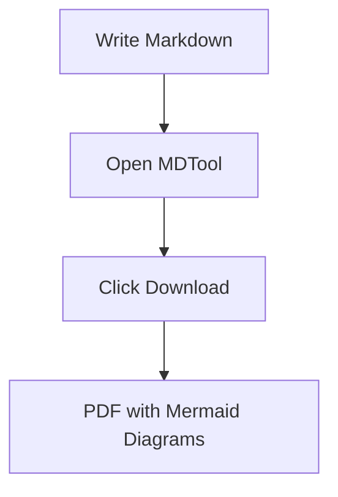

## Finding the Best Markdown to PDF Converter

<Callout type="success">
**Quick pick**

- **One file, private, no install:** [MDTool](/markdown-to-pdf). Free, runs in your browser, highlights code and renders Mermaid. No CLI, and no emoji in the PDF.
- **Scripts, CI or book-quality typesetting:** [Pandoc](https://pandoc.org/MANUAL.html). Needs installing and, for its default route, a LaTeX distribution.
- **Batch jobs inside a larger file-conversion workflow:** CloudConvert. It has an API, but files are uploaded and the free tier allows 10 conversions a day.
- **Writing and exporting in one web editor:** Dillinger. Its PDF is generated on its server.

Disclosure: MDTool is our tool. The comparison below lists its limitations next to everyone else's.
</Callout>

If you've spent ten minutes searching for the best Markdown to PDF converter, you've already noticed the problem: every tool claims to "fully support Markdown," but the results tell a different story. Code blocks lose syntax highlighting. Tables get mangled. Mermaid diagrams just vanish. And half the tools require you to create an account before you can download a single file.

This is a feature comparison, not a lab test. The "How we evaluated" section below explains exactly what we checked and what we didn't.

---

## The Contenders

### markdowntopdf.com

<a href="https://www.markdowntopdf.com" rel="nofollow noopener" target="_blank">markdowntopdf.com</a> is one of the oldest tools in this category, and it has changed a lot. Its site now lists a live editor, curated themes, syntax-highlighted code, Mermaid diagrams and LaTeX/KaTeX math. Guests can use it without an account, but the free download includes a watermark; removing it takes a paid Pro plan or a day pass. The site doesn't say whether conversion happens in your browser or on its servers.

### Dillinger

<a href="https://dillinger.io" rel="nofollow noopener" target="_blank">Dillinger</a> is primarily a Markdown editor with a live preview, and it exports Markdown, styled HTML or PDF. Its source code is [public on GitHub](https://github.com/joemccann/dillinger), so we can say precisely how the PDF is made: the editor sends your Markdown to a server route that renders it with markdown-it and highlight.js and prints it with headless Chromium. That means code highlighting and KaTeX math work, but Mermaid isn't rendered, and your document does leave the browser when you export. It's free and needs no login.

### CloudConvert

<a href="https://cloudconvert.com" rel="nofollow noopener" target="_blank">CloudConvert</a> is a general-purpose file conversion service that supports Markdown to PDF among hundreds of other formats. Its [pricing page](https://cloudconvert.com/pricing) lists a free tier of 10 conversions per day, with API access included. Files are uploaded to its servers for processing. Code block styling varies by template, and Mermaid isn't rendered in the standard Markdown pipeline.

### Pandoc (CLI)

<a href="https://pandoc.org" rel="nofollow noopener" target="_blank">Pandoc</a> is the gold standard for document conversion among developers who are comfortable with the command line. It supports an enormous range of output formats, has excellent handling of code blocks (via `--syntax-highlighting` in Pandoc 3.8 and later, `--highlight-style` before that), and can be extended with custom LaTeX templates for pixel-perfect output. However, it requires installation, has a steep learning curve for custom styling, and has no web UI. Mermaid diagrams require a pre-processing step with a separate tool. If you want maximum control and don't mind the setup, Pandoc is powerful, but it's not something you'd use for a quick conversion. Our [Pandoc, Python and Node guide](/blog/markdown-to-pdf-python-pandoc) has working commands.

### MDTool

MDTool is a free, browser-based Markdown to PDF converter built specifically for developers. Conversion runs entirely client-side, so your Markdown is never sent to a server. It highlights code in common languages (JavaScript, TypeScript, Python, Bash, Go, Rust, SQL, JSON, YAML, HTML, CSS and Dart), renders Mermaid diagrams, offers four themes (GitHub, Academic, Minimal, Dark) on A4 or Letter paper, and supports manual page breaks. No login, no account, no watermark.

Its limitations are just as concrete:

- **No emoji in the PDF.** The PDF font has no emoji glyphs, so emoji are left out of the file rather than shown as empty boxes.
- **Browser only.** There's no CLI or API, so it can't run in a script or CI job.
- **Narrower syntax than Pandoc.** It uses GitHub Flavored Markdown, so footnotes, definition lists and math aren't rendered.
- **The Word export is more limited than the PDF export.** [Markdown to Word](/markdown-to-word) produces a real .docx with native heading styles, but Mermaid diagrams and images aren't included in Word yet.

---

## Side-by-Side Comparison

*Features checked against each tool's own site and documentation (and Dillinger's source code) as of October 2026. Competitor products change, so verify current behavior before relying on it.*

| Tool | Free | Code highlighting | Mermaid | Runs locally | CLI / API | Main limitation |
|------|------|-------------------|---------|--------------|-----------|-----------------|
| **MDTool** | Yes | Yes | Yes | Yes (browser) | No | No emoji in PDF; no footnotes or math; Word export lacks Mermaid and images |
| markdowntopdf.com | Watermark on free downloads | Yes (stated) | Yes (stated) | Not stated | No | Pay to remove the watermark |
| Dillinger | Yes | Yes | No | No (server-side PDF) | No | Document is sent to its server on export |
| CloudConvert | 10 conversions/day | Partial | No | No (upload) | Yes | Upload required; daily cap |
| Pandoc | Yes | Yes | With a filter* | Yes (installed) | Yes | Setup and LaTeX or CSS knowledge |

*Pandoc can render Mermaid with a pre-processing step such as mermaid-cli or mermaid-filter, but it isn't built in.

---

## How we evaluated

We compared the tools on five criteria that matter for developer documentation:

1. **Code highlighting** in the exported PDF, not just in a preview.
2. **Mermaid rendering**, since diagrams in Markdown are increasingly common.
3. **Where processing happens**: in your browser, on your machine, or on someone else's server.
4. **Access cost**: price, signup, daily caps and watermarks.
5. **Automation**: whether there's a CLI or API for repeat jobs.

For each competitor, we used what the tool states on its own website, pricing page or documentation. For Dillinger we also read its open-source code to confirm how the PDF is produced. For Pandoc we used the official manual. We did not run the same test document through every tool or score output quality side by side, so this table says what each tool supports, not how good its output looks. For MDTool, we describe the tool as built, including the limitations above.

If you're choosing a tool for important documents, run your own file through your top two picks. Tables, long code lines and diagrams are the elements most likely to differ.

<Callout type="info">
  "Client-side" means your Markdown content is processed in your browser and never uploaded to a remote server. For code containing credentials, proprietary logic, or sensitive data, this distinction matters.
</Callout>

---

## Why Client-Side Conversion Matters

Most online converters work the same way: you paste or upload your Markdown, their server parses it and generates a PDF, then sends the file back to you. This is fine for public documentation, but it creates real concerns when your Markdown contains:

- **API keys or credentials** hardcoded in example snippets
- **Proprietary algorithms** or internal business logic in code blocks
- **Unreleased features** you're documenting before launch
- **Internal architecture diagrams** in Mermaid format

With a server-side tool, every document you convert passes through someone else's infrastructure. Even if the provider claims not to store your content, the data still transits their network and lands in their process memory.

MDTool runs the entire conversion pipeline in your browser using `pdfmake`, which writes real, selectable text into the PDF. When you click Download, the PDF is assembled locally from your rendered HTML, and nothing is transmitted. This isn't a marketing claim; it's a consequence of how the tool is built. Open the browser's Network tab while converting and you'll see zero outbound requests carrying your content.

For teams working on open-source projects or public documentation, this may not matter. For developers handling internal documentation, security write-ups, or architecture decisions, it matters considerably.

---

## What "Code Highlighting" Actually Means in Practice

The comparison table marks several tools as having "partial" code highlighting. Here's what that means in practice.

A tool that claims to support code highlighting might:

- Apply a monospace font but no color differentiation between keywords, strings, and identifiers
- Highlight code in the browser preview but strip the colors when generating the PDF
- Support only a handful of languages (JavaScript and Python, but not Rust, Go, or SQL)
- Render highlighting correctly for light themes but lose it entirely for dark themes

MDTool uses `highlight.js` for token-level syntax highlighting, applied both in the live preview and in the final PDF output, with a color palette matched to each theme. The PDF is built from the same rendered HTML as the preview, so keywords, strings and comments keep their colors.

If your Markdown documents contain multi-language code blocks, mixing shell commands, JavaScript, and SQL in the same file, full language-aware highlighting is the difference between a readable technical document and a wall of monochrome text.

---

## Mermaid Diagram Support

Mermaid is increasingly common in developer documentation. A flowchart that looks like this in Markdown:

````markdown

```mermaid
graph TD
  A[Write Markdown] --> B[Open MDTool]
  B --> C[Click Download]
  C --> D[PDF with Mermaid Diagrams]
```
````

Should render as an actual diagram in the PDF, not as a raw text block. In this comparison, MDTool renders Mermaid in the PDF and markdowntopdf.com states that it does. Dillinger and CloudConvert don't render it, and Pandoc needs a pre-processing step.

This is a technically harder problem than code highlighting because Mermaid diagrams have to be rendered into SVG or canvas before the PDF is generated. MDTool handles this by running the Mermaid renderer in the browser before the PDF export step, so each diagram is already drawn when the PDF is built.

---

## Try the Best Markdown to PDF Converter Right Here

You don't need to navigate away. Paste your Markdown below and download the PDF directly:

<EmbeddedTool />

---

## When Should You Use Each Tool?

**Use MDTool when** you need a quick, private, browser-based conversion with code highlighting and Mermaid support, especially for internal or proprietary documentation.

**Don't use MDTool when** you need to convert files from a script or CI job, your document relies on emoji, footnotes or math, or you need diagrams in a Word file.

**Use Dillinger when** you're already writing in Dillinger and your document isn't sensitive, since the PDF is generated on its server.

**Use Pandoc when** you need maximum control over output formatting, are comfortable with the CLI, and don't mind setting up a processing pipeline for each project.

**Use CloudConvert when** you're converting Markdown as part of a larger file processing workflow and need batch conversions or API access.

**Use markdowntopdf.com when** you want curated document themes and math support and don't mind the watermark on free downloads, or you're willing to pay to remove it.

---

## The Verdict

The best Markdown to PDF converter for developers in 2026 is one that:

1. Preserves code block formatting with syntax highlighting
2. Renders Mermaid diagrams
3. Runs client-side to protect your content
4. Requires no login or account
5. Produces clean, readable output across themes

Of the tools compared here, MDTool is the one that combines all five: free with no watermark, no login, client-side, with highlighted code and rendered Mermaid. That makes it a strong default for developer documentation such as READMEs, architecture notes and internal specs. It isn't the right tool for automation, emoji-heavy documents, or Pandoc-specific syntax; use Pandoc for those.

**[Open the Markdown to PDF converter →](/markdown-to-pdf)**

For deeper dives into specific failure modes, see our guides on [code blocks breaking in PDF exports](/blog/markdown-to-pdf-code-blocks) and [converting GitHub READMEs to PDF](/blog/github-readme-to-pdf), or check the [full Markdown syntax cheatsheet](/markdown-cheat-sheet).

---

## Frequently Asked Questions

**Q: Is MDTool really free with no limits?**

Yes. There's no free tier with a conversion cap, no watermark on the output, and no account required. The tool is supported by non-intrusive ads and will remain free.

**Q: Can I use MDTool for commercial projects?**

Yes. The PDF you generate is yours, with no MDTool branding in the output.

**Q: What can't MDTool do?**

It can't run from the command line or an API, it doesn't include emoji in the PDF, and it doesn't render footnotes, definition lists or math. Its Word export doesn't include Mermaid diagrams or images yet. For any of those, Pandoc is the better choice.

**Q: Does MDTool support every Markdown flavor?**

MDTool uses the `marked` parser with GFM (GitHub Flavored Markdown) extensions enabled, which covers tables, task lists, fenced code blocks, and strikethrough. It does not support every Pandoc-style extension (like footnotes or definition lists), but covers the vast majority of what developers write day to day.

**Q: How does MDTool compare to VS Code's Markdown PDF extension?**

The VS Code extension is excellent for local workflows: it uses a Chromium-based renderer for accurate output and has good code highlighting. The main advantage of MDTool is that it works in any browser without installing anything, making it easier to share with non-developer teammates or use on a machine where you can't install extensions.

**Q: What file size can MDTool handle?**

Because conversion happens in your browser, the practical limit is your device's available RAM rather than a server-side cap. In practice, documents up to several hundred kilobytes of Markdown (with images) convert without issue on any modern machine.
