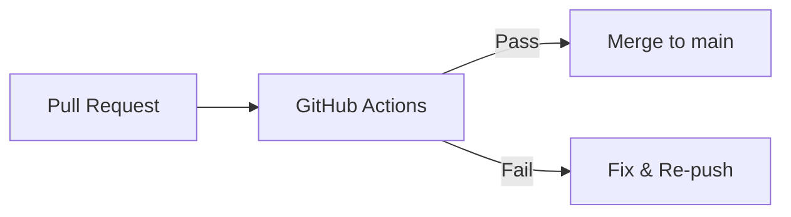

## Converting a GitHub README to PDF

GitHub READMEs are written in [GitHub Flavored Markdown (GFM)](https://github.github.com/gfm/) — a superset of standard Markdown that adds tables, task lists, fenced code blocks, strikethrough, and autolinks. Most PDF converters choke on at least one of these extensions. Badges disappear. Tables collapse into a single column. Mermaid diagrams appear as raw text. Code blocks lose their formatting.

This guide walks through exactly how to convert a GitHub README to PDF without losing any of it.

---

## What Makes GitHub READMEs Different from Ordinary Markdown

A typical README contains several elements that generic Markdown parsers struggle with:

**Badge images** — Lines like `` fetch images from [shields.io](https://shields.io/) and similar external URLs. Server-side converters often block external requests; browser-based tools load them normally.

**Fenced code blocks with language tags** — GitHub renders these with syntax highlighting. A PDF converter needs to do the same, not just preserve the raw text.

**GFM tables** — Pipe-delimited tables (`| Col1 | Col2 |`) only work if the parser has GFM mode enabled. Standard CommonMark parsers ignore them entirely.

**Task lists** — `- [x] Done` and `- [ ] Todo` syntax renders as checkboxes on GitHub. A GFM-aware converter renders them as actual checkbox characters; others render them as literal brackets.

**Mermaid diagrams** — GitHub natively renders `mermaid` code fences as diagrams. Most PDF tools don't support this at all.

---

## Step-by-Step: GitHub README to PDF

### Step 1 — Get the Raw Markdown

On any GitHub repository page, click the file name of `README.md` (or `README.mdx`), then click **Raw** in the top-right toolbar. You'll see the plain Markdown source. Select all (`Ctrl+A`) and copy it.

Alternatively, you can download the raw file directly:

```bash
curl -o README.md https://raw.githubusercontent.com/user/repo/main/README.md
```

### Step 2 — Paste Into MDTool

Open the converter below (or at [/markdown-to-pdf](/markdown-to-pdf)) and paste your README. The live preview on the right renders immediately — you'll see headings, tables, code blocks, and badges appear in real time.

### Step 3 — Check Badges and External Images

Badges (`shields.io`, `github.com/actions/...`) are standard `` tags in the rendered HTML. Because MDTool runs in your browser, those images load normally from their external URLs — the same way they load on GitHub. You should see them in the preview.

If a badge doesn't appear, it's usually because:
- The image URL requires authentication (private repo badges)
- The external server is rate-limiting requests

In those cases, either remove the badge row before converting or replace the URL with a static image URL that doesn't require auth.

### Step 4 — Select a Theme

The **GitHub** theme in MDTool mirrors GitHub's own rendering style: `system-ui` font family, `#24292e` text color, blue links, light-gray code backgrounds, and bordered tables. If you want the PDF to look as close to GitHub's rendered view as possible, use the GitHub theme.

### Step 5 — Download the PDF

Click **Download PDF**. The entire conversion runs in your browser — your README content is never uploaded to any server.

<Callout type="info">
  For READMEs with Mermaid diagrams, MDTool renders the diagram SVGs before capturing the PDF. The flowchart, sequence diagram, or ER diagram you see in the preview will appear correctly in the PDF output.
</Callout>

---

## Handling Common README Elements

### Code Blocks

GitHub READMEs frequently include multi-language code blocks. MDTool uses `highlight.js` with GFM mode, supporting JavaScript, TypeScript, Python, Bash, Go, Rust, SQL, JSON, YAML, HTML, CSS, and more.

A block like this:

````markdown
```typescript
export async function fetchRepo(owner: string, repo: string) {
  const res = await fetch(`https://api.github.com/repos/${owner}/${repo}`);
  if (!res.ok) throw new Error(`GitHub API error: ${res.status}`);
  return res.json();
}
```
````

Renders with full syntax coloring — keywords, strings, types, and function names each get distinct colors, exactly as they appear on GitHub.

### Tables

GFM tables convert cleanly. A README table like:

```markdown
| Feature       | Status |
|---------------|--------|
| Code blocks   | ✅     |
| Mermaid       | ✅     |
| Badges        | ✅     |
| Task lists    | ✅     |
```

Will appear as a properly bordered, styled table in the PDF — not as a pipe-delimited text wall.

### Mermaid Diagrams

Project architecture diagrams in READMEs are often written in Mermaid. MDTool initializes the Mermaid renderer in the browser before the PDF export step, so:

````markdown

````

Renders as an actual diagram in the PDF, not as a code block with raw Mermaid syntax.

### Task Lists

```markdown
- [x] Set up CI pipeline
- [x] Write unit tests
- [ ] Add integration tests
- [ ] Deploy to production
```

MDTool's GFM parser renders these as ☑ and ☐ characters in the PDF, preserving the visual meaning of your task list.

---

## Try It Now — Convert Your GitHub README

Paste your README below and download the PDF in seconds:

<EmbeddedTool />

---

## Privacy: Why Client-Side Conversion Matters for READMEs

Private repositories often have READMEs containing internal architecture decisions, credentials in example snippets, or unreleased feature documentation. When you use a server-side converter, that content passes through someone else's infrastructure.

MDTool converts your README entirely in the browser using `html2pdf.js`. When you click Download, the PDF is assembled from the rendered HTML on your machine. Open the browser's Network tab while converting — you'll see zero requests carrying your Markdown content outbound. Your README stays on your device.

---

## Comparing GitHub README to PDF Tools

| Tool | GFM Tables | Code Highlighting | Mermaid | No Upload | Free |
|------|-----------|------------------|---------|-----------|------|
| **MDTool** | ✅ | ✅ | ✅ | ✅ | ✅ |
| Dillinger | ✅ | Partial | ❌ | ✅ | ✅ |
| CloudConvert | Partial | Partial | ❌ | ❌ | Limited |
| markdowntopdf.com | Partial | ❌ | ❌ | ❌ | ✅ |

For a deeper comparison, see our [best Markdown to PDF converters guide](/blog/best-markdown-to-pdf-converter), or check the [full Markdown syntax cheatsheet](/blog/markdown-cheatsheet) for every element a README might use.

---

## Frequently Asked Questions

**Q: Can I convert a private GitHub README?**

Yes — copy the raw Markdown content and paste it into MDTool. Since conversion is client-side, your content never leaves your browser. You don't need to connect MDTool to your GitHub account.

**Q: Badges are showing as broken images in the PDF. What do I do?**

This usually means the badge URL is either rate-limited or requires authentication. The simplest fix is to delete the badge row from the Markdown before converting. Alternatively, right-click the badge on GitHub, copy the image address, and replace the dynamic URL with the resolved static URL.

**Q: My README has a very long table. Will it fit on the page?**

Wide tables are the hardest element to handle in any Markdown-to-PDF workflow. MDTool sets the PDF width to A4 (794px at screen scale). If your table has more than 5–6 columns, consider reducing column content or splitting it into multiple smaller tables before converting.

**Q: Does MDTool support GitHub's custom `> [!NOTE]` alert syntax?**

GitHub's alert extensions (`> [!NOTE]`, `> [!WARNING]`, etc.) are a recent addition that isn't yet part of the GFM spec. MDTool renders them as standard blockquotes. You'll see the content, but without the colored border and icon that GitHub adds.

**Q: Can I automate README to PDF conversion?**

MDTool is a browser-based tool designed for manual conversions. For automated pipelines — generating PDFs in CI, for example — consider using Pandoc with a custom template or a headless Puppeteer/Playwright script. For code with syntax highlighting and Mermaid support in CI, see our guide on [Markdown to PDF code blocks](/blog/markdown-to-pdf-code-blocks).

**Q: Does the PDF include anchor links (internal links within the README)?**

Internal anchor links (e.g., `[See Installation](#installation)`) are preserved as links in the PDF. Whether they work depends on the PDF viewer — most desktop PDF viewers support internal anchor navigation.
