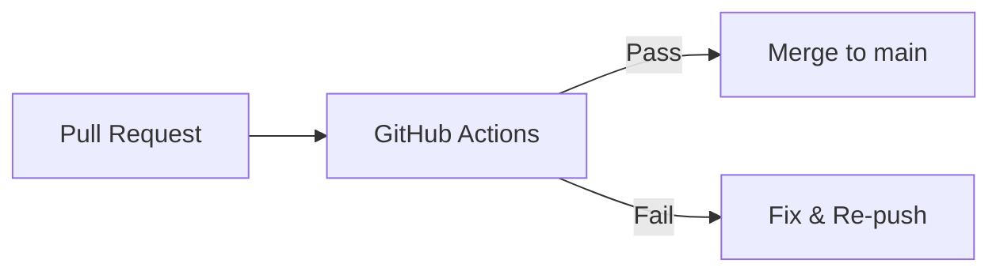

## How do I download a GitHub README as PDF?

GitHub has no "Download as PDF" button, but converting a README to PDF takes three steps:

1. **Copy the raw Markdown.** Open `README.md` in the repository, click **Raw**, then select all and copy. (Or use the copy button in the file toolbar to copy the raw content directly.)
2. **Paste it into a converter.** Open [MDTool's Markdown to PDF converter](/markdown-to-pdf) and paste. The preview renders headings, tables, code and Mermaid diagrams as you'd see them on GitHub.
3. **Download the PDF.** Pick the **GitHub** theme, choose A4 or Letter, and click **Download PDF**.

That's the whole answer to "how to download a GitHub README as PDF." It works for public and private repositories, needs no account, and runs in your browser, so the README is never uploaded. The rest of this guide covers what makes a README harder to convert than ordinary Markdown, and how to handle private repos, images and relative paths.

---

## Converting a GitHub README to PDF

GitHub READMEs are written in [GitHub Flavored Markdown (GFM)](https://github.github.com/gfm/), a superset of standard Markdown that adds tables, task lists, fenced code blocks, strikethrough, and autolinks. Most PDF converters choke on at least one of these extensions. Badges disappear. Tables collapse into a single column. Mermaid diagrams appear as raw text. Code blocks lose their formatting.

This guide walks through exactly how to convert a GitHub README to PDF without losing any of it.

---

## What Makes GitHub READMEs Different from Ordinary Markdown

A typical README contains several elements that generic Markdown parsers struggle with:

**Badge images.** Lines like `` fetch images from [shields.io](https://shields.io/) and similar external URLs. Server-side converters often block external requests; browser-based tools load them normally.

**Fenced code blocks with language tags.** GitHub renders these with syntax highlighting. A PDF converter needs to do the same, not just preserve the raw text.

**GFM tables.** Pipe-delimited tables (`| Col1 | Col2 |`) only work if the parser has GFM mode enabled. Standard CommonMark parsers ignore them entirely.

**Task lists.** `- [x] Done` and `- [ ] Todo` syntax renders as checkboxes on GitHub. A GFM-aware converter renders them as actual checkbox characters; others render them as literal brackets.

**Mermaid diagrams.** GitHub natively renders `mermaid` code fences as diagrams. Most PDF tools don't support this at all.

---

## Step-by-Step: GitHub README to PDF

### Step 1: Get the Raw Markdown

On any GitHub repository page, click the file name of `README.md` (or `README.mdx`), then click **Raw** in the top-right toolbar. You'll see the plain Markdown source. Select all (`Ctrl+A`) and copy it.

Alternatively, you can download the raw file directly:

```bash
curl -o README.md https://raw.githubusercontent.com/user/repo/main/README.md
```

### Step 2: Paste Into MDTool

Open the converter below (or at [/markdown-to-pdf](/markdown-to-pdf)) and paste your README. The live preview on the right renders immediately, and you'll see headings, tables, code blocks, and badges appear in real time.

### Step 3: Check Badges and External Images

Badges (`shields.io`, `github.com/actions/...`) are standard `` tags in the rendered HTML. Because MDTool runs in your browser, those images load normally from their external URLs, the same way they load on GitHub. You should see them in the preview.

If a badge doesn't appear, it's usually because:
- The image URL requires authentication (private repo badges)
- The external server is rate-limiting requests

In those cases, either remove the badge row before converting or replace the URL with a static image URL that doesn't require auth.

### Step 4: Select a Theme

The **GitHub** theme in MDTool follows GitHub's own rendering style: dark body text, blue links, light-gray code backgrounds, and bordered tables. If you want the PDF to look as close to GitHub's rendered view as possible, use the GitHub theme. The other themes are Academic, Minimal and Dark, and every theme works with A4 or Letter paper.

### Step 5: Download the PDF

Click **Download PDF**. The entire conversion runs in your browser, so your README content is never uploaded to any server.

<Callout type="info">
  For READMEs with Mermaid diagrams, MDTool renders the diagrams before it builds the PDF. The flowchart, sequence diagram, or ER diagram you see in the preview will appear correctly in the PDF output.
</Callout>

---

## Handling Common README Elements

### Code Blocks

GitHub READMEs frequently include multi-language code blocks. MDTool uses `highlight.js` with GFM mode, supporting JavaScript, TypeScript, Python, Bash, Go, Rust, SQL, JSON, YAML, HTML, CSS, Dart and more.

A block like this:

````markdown
```typescript
export async function fetchRepo(owner: string, repo: string) {
  const res = await fetch(`https://api.github.com/repos/${owner}/${repo}`);
  if (!res.ok) throw new Error(`GitHub API error: ${res.status}`);
  return res.json();
}
```
````

Renders with full syntax coloring: keywords, strings, types, and function names each get distinct colors, exactly as they appear on GitHub.

### Tables

GFM tables convert cleanly. A README table like:

```markdown
| Feature       | Status |
|---------------|--------|
| Code blocks   | ✅     |
| Mermaid       | ✅     |
| Badges        | ✅     |
| Task lists    | ✅     |
```

Will appear as a properly bordered, styled table in the PDF, not as a pipe-delimited text wall.

### Mermaid Diagrams

Project architecture diagrams in READMEs are often written in Mermaid. MDTool initializes the Mermaid renderer in the browser before the PDF export step, so:

````markdown

```mermaid
graph LR
  PR[Pull Request] --> CI[GitHub Actions]
  CI -->|Pass| Merge[Merge to main]
  CI -->|Fail| Fix[Fix & Re-push]
```
````

Renders as an actual diagram in the PDF, not as a code block with raw Mermaid syntax.

### Task Lists

```markdown
- [x] Set up CI pipeline
- [x] Write unit tests
- [ ] Add integration tests
- [ ] Deploy to production
```

MDTool's GFM parser recognizes task lists. In the PDF, each checkbox is drawn as a bold monospace `[x]` (done) or `[ ]` (to do), so the status stays readable even when printed in black and white.

---

## Private repositories and READMEs with images

The three-step method works the same for a private repository, because you copy the Markdown while you're signed in to GitHub and nothing about the conversion needs repository access. Two things behave differently, though.

**Getting the file from the command line.** `raw.githubusercontent.com` URLs for private repos need authentication, so a plain `curl` returns a 404. Use the GitHub CLI, which calls the REST API's [Get a repository README](https://docs.github.com/en/rest/repos/contents) endpoint with your credentials:

```bash
gh api repos/OWNER/REPO/readme -H "Accept: application/vnd.github.raw+json" > README.md
```

**Images.** Images stored in a private repository can't be fetched by anyone who isn't signed in with access, and the image links GitHub generates for private content are short-lived signed URLs. An image URL you copy from the rendered page may work for a few minutes and then break. For a PDF that keeps its images:

- Move the images somewhere public you control (a docs site, a public assets repo, or an object storage bucket) and point the Markdown at those URLs, or
- Remove the images and describe them in text if the PDF is going to an audience that only needs the content.

Badges (`shields.io` and similar) are public images, so they usually load fine even for private repositories. Status badges that query a private repo's CI may show "unknown" or fail to load, and deleting the badge row before converting is the quickest fix.

---

## Relative image paths: use raw.githubusercontent.com URLs

GitHub recommends [relative links for images](https://docs.github.com/en/repositories/managing-your-repositorys-settings-and-features/customizing-your-repository/about-readmes) in READMEs, such as ``. GitHub resolves those paths against the repository and branch you're viewing. Once you copy the Markdown out of GitHub, there's no repository to resolve against, so the image is missing from the preview and the PDF.

The fix is to turn each relative path into an absolute `raw.githubusercontent.com` URL:

```markdown
<!-- Before: relative path, only works on GitHub -->


<!-- After: absolute raw URL, works anywhere -->

```

The pattern is `https://raw.githubusercontent.com/OWNER/REPO/BRANCH/PATH`. These URLs send the cross-origin headers a browser needs to embed the image, which is why they work in a browser-based converter. Replace `main` with your default branch (or a tag, if you want the PDF to match a release). Paths that start with `./` or `../` work the same way once you resolve them from the README's folder.

To fix every image at once, a find-and-replace in your editor does the job. Replace `](docs/` with `](https://raw.githubusercontent.com/OWNER/REPO/main/docs/` and adjust for each folder your README uses. Images that already use absolute `https://` URLs don't need changing.

If MDTool can't fetch an image (a broken path, a private URL, or a server that blocks cross-origin requests), the PDF shows a gray `[image: alt text]` placeholder in its place instead of failing. Search the PDF for "[image:" to find any you missed.

---

## Try It Now: Convert Your GitHub README

Paste your README below and download the PDF in seconds:

<EmbeddedTool />

---

## Privacy: Why Client-Side Conversion Matters for READMEs

Private repositories often have READMEs containing internal architecture decisions, credentials in example snippets, or unreleased feature documentation. When you use a server-side converter, that content passes through someone else's infrastructure.

MDTool converts your README entirely in the browser using `pdfmake`, which writes real, selectable text into the PDF. When you click Download, the PDF is assembled from the rendered HTML on your machine. Open the browser's Network tab while converting and you'll see zero requests carrying your Markdown content outbound. Your README stays on your device.

---

## Comparing GitHub README to PDF Tools

| Tool | GFM Tables | Code Highlighting | Mermaid | No Upload | Free |
|------|-----------|------------------|---------|-----------|------|
| **MDTool** | ✅ | ✅ | ✅ | ✅ | ✅ (no emoji in PDF) |
| Dillinger | ✅ | ✅ | ❌ | ❌ (PDF built on its server) | ✅ |
| CloudConvert | Partial | Partial | ❌ | ❌ | 10 conversions/day |
| markdowntopdf.com | ✅ | ✅ | ✅ | Not stated | Watermark on free downloads |

*Competitor features checked against each tool's site and, for Dillinger, its [open-source code](https://github.com/joemccann/dillinger), as of October 2026.*

For a deeper comparison, see our [best Markdown to PDF converters guide](/blog/best-markdown-to-pdf-converter), or check the [full Markdown syntax cheatsheet](/markdown-cheat-sheet) for every element a README might use.

---

## Frequently Asked Questions

**Q: How do I convert a README to PDF?**

Open the README on GitHub, click Raw, copy the Markdown, paste it into a Markdown to PDF converter such as MDTool, and click Download PDF. Choose the GitHub theme if you want the PDF to look like the README on GitHub.

**Q: Why are images missing from my README PDF?**

Most READMEs use relative image paths like `docs/screenshot.png`, which only resolve on GitHub. Replace them with absolute `https://raw.githubusercontent.com/OWNER/REPO/BRANCH/PATH` URLs before converting. Images from private repositories also need to be hosted somewhere public.

**Q: Can I convert a private GitHub README?**

Yes. Copy the raw Markdown content and paste it into MDTool. Since conversion is client-side, your content never leaves your browser. You don't need to connect MDTool to your GitHub account.

**Q: Badges are showing as broken images in the PDF. What do I do?**

This usually means the badge URL is either rate-limited or requires authentication (common for private repositories). The simplest fix is to delete the badge row from the Markdown before converting. Alternatively, right-click the badge on GitHub, copy the image address, and replace the dynamic URL with the resolved static URL.

**Q: My README has a very long table. Will it fit on the page?**

Wide tables are the hardest element to handle in any Markdown-to-PDF workflow. MDTool lays the PDF out on A4 or Letter paper, and long words and URLs in cells are allowed to wrap. If your table has more than 5 to 6 columns, consider shortening cell content or splitting it into smaller tables before converting.

**Q: Does MDTool support GitHub's custom `> [!NOTE]` alert syntax?**

GitHub's alert extensions (`> [!NOTE]`, `> [!WARNING]`, etc.) are a recent addition that isn't yet part of the GFM spec. MDTool renders them as standard blockquotes. You'll see the content, but without the colored border and icon that GitHub adds.

**Q: Can I automate README to PDF conversion?**

MDTool is a browser-based tool designed for manual conversions; it has no CLI or API. For automated pipelines, such as generating PDFs in CI, see our guide to [Markdown to PDF with Python, Pandoc and Node](/blog/markdown-to-pdf-python-pandoc). For code with syntax highlighting and Mermaid support in CI, see our guide on [Markdown to PDF code blocks](/blog/markdown-to-pdf-code-blocks).

**Q: Does the PDF include anchor links (internal links within the README)?**

Internal anchor links (e.g., `[See Installation](#installation)`) are preserved as links in the PDF. Whether they work depends on the PDF viewer, and most desktop PDF viewers support internal anchor navigation.
