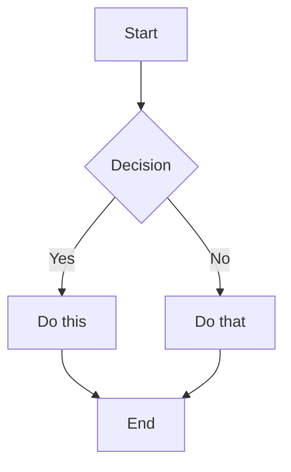
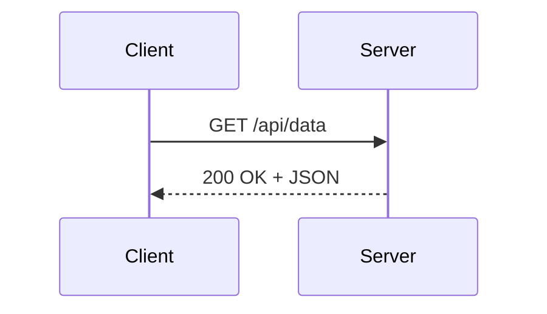

## The Complete Markdown Cheatsheet

This is a single-page reference for every Markdown syntax you'll encounter — from basic headings to GFM extensions like tables, task lists, and footnotes. Each example shows the raw Markdown and what it produces.

Bookmark this page. You'll use it.

---

## Headings

```markdown
# Heading 1
## Heading 2
### Heading 3
#### Heading 4
##### Heading 5
###### Heading 6
```

Headings use `#` symbols — one per level. Always put a space between `#` and the heading text. Heading 1 is typically the document title; use Heading 2 and 3 for sections and subsections.

**Alternative syntax** (Setext style, works for H1 and H2 only):

```markdown
Heading 1
=========

Heading 2
---------
```

---

## Emphasis and Formatting

```markdown
**bold text**
__also bold__

*italic text*
_also italic_

***bold and italic***

~~strikethrough~~

`inline code`
```

- Use `**` for bold, `*` for italic
- Use `~~` for strikethrough (GFM extension)
- Use backticks for inline code — it uses a monospace font and a gray background

---

## Line Breaks and Paragraphs

```markdown
This is the first paragraph.

This is the second paragraph. A blank line separates paragraphs.

This line ends with two spaces
and this continues on the next line (soft break).
```

A blank line creates a new paragraph. Two trailing spaces (or `\` at the end of a line in some parsers) create a line break without a paragraph gap.

---

## Lists

### Unordered Lists

```markdown
- Item one
- Item two
  - Nested item (indent 2 spaces)
  - Another nested item
- Item three

* Also works with asterisks
+ Or plus signs
```

### Ordered Lists

```markdown
1. First item
2. Second item
3. Third item
   1. Nested ordered list (indent 3 spaces)
   2. Another nested item
```

The numbers don't have to be in sequence — Markdown only uses the first number and increments automatically. `1. 1. 1.` renders as `1. 2. 3.`

### Task Lists (GFM)

```markdown
- [x] Write the README
- [x] Add CI pipeline
- [ ] Write integration tests
- [ ] Deploy to production
```

Renders as checkboxes. `[x]` is checked; `[ ]` is unchecked. This is a GitHub Flavored Markdown extension.

---

## Links

```markdown
[Link text](https://example.com)

[Link with title](https://example.com "Tooltip text on hover")

[Reference-style link][ref-id]

[ref-id]: https://example.com "Optional title"

https://example.com (autolink — GFM only)

<https://example.com> (angle bracket autolink)
```

Reference-style links keep your prose readable when you have many URLs — define them all at the bottom of the document.

---

## Images

```markdown


[](https://example.com)
```

Images use the same syntax as links but with a leading `!`. The alt text is required for accessibility and appears if the image fails to load.

The third example is a clickable image-link — common for README badges.

---

## Code

### Inline Code

```markdown
Use `console.log()` to debug, or `process.env.NODE_ENV` to check the environment.
```

### Fenced Code Blocks

````markdown
```javascript
const greet = (name) => {
  return `Hello, ${name}!`;
};
```
````

Add the language name immediately after the opening triple backticks. This enables syntax highlighting in supported renderers. Common language tags:

| Language | Tag |
|----------|-----|
| JavaScript | `javascript` or `js` |
| TypeScript | `typescript` or `ts` |
| Python | `python` or `py` |
| Bash/Shell | `bash` or `sh` |
| JSON | `json` |
| HTML | `html` |
| CSS | `css` |
| SQL | `sql` |
| Go | `go` |
| Rust | `rust` |
| YAML | `yaml` or `yml` |

### Code Blocks with Backtick Escaping

To include triple backticks inside a code block, wrap the outer block with four backticks:

`````markdown
````markdown
```javascript
// this is inside a code block example
```
````
`````

---

## Blockquotes

```markdown
> This is a blockquote.
>
> It can span multiple paragraphs.

> Nested quote:
>
> > This is nested one level deeper.
> >
> > > And one more level.

> **Note:** You can use **bold**, *italic*, and `inline code` inside blockquotes.
```

Blockquotes are commonly used for notes, warnings, pull quotes, and cited content.

### GitHub Alert Syntax (GFM Extension)

```markdown
> [!NOTE]
> Useful information that users should know.

> [!WARNING]
> Critical information requiring immediate attention.

> [!TIP]
> Helpful advice for better usage.
```

This renders with a colored border and icon on GitHub. Not all parsers support it — it falls back to a standard blockquote.

---

## Tables (GFM)

```markdown
| Column 1 | Column 2 | Column 3 |
|----------|----------|----------|
| Cell     | Cell     | Cell     |
| Cell     | Cell     | Cell     |
```

### Column Alignment

```markdown
| Left     | Center   | Right    |
|:---------|:--------:|----------:|
| aligned  | aligned  | aligned  |
```

- `:---` — left (default)
- `:---:` — centered
- `---:` — right-aligned

Tables are a [GFM](https://github.github.com/gfm/#tables-extension-) extension — they don't work in strict [CommonMark](https://commonmark.org/) parsers. See our full guide on [Markdown tables in PDF exports](/blog/markdown-table-pdf) for rendering tips.

---

## Horizontal Rules

```markdown
---

***

___
```

Three or more hyphens, asterisks, or underscores create a horizontal rule. Put blank lines above and below to avoid ambiguity with Setext headings.

---

## HTML in Markdown

Most Markdown parsers allow raw HTML inline and in blocks:

```markdown
This paragraph has <strong>bold</strong> and <em>italic</em> via HTML.

<div style="background: #f0f0f0; padding: 12px; border-radius: 4px;">
  This is a styled block using raw HTML.
</div>

<details>
  <summary>Click to expand</summary>
  Hidden content here.
</details>
```

HTML is especially useful for elements Markdown can't express: collapsible sections (`<details>`), custom styled containers, and complex table layouts with `colspan`/`rowspan`.

---

## Escaping Characters

```markdown
\*Not italic — the asterisks are escaped\*

\# Not a heading

\[Not a link\](https://example.com)
```

Prefix any Markdown character with a backslash to render it literally. Characters that can be escaped: `\ * _ { } [ ] ( ) # + - . !`

---

## Footnotes (Extended Syntax)

```markdown
Here is a sentence with a footnote.[^1]

[^1]: This is the footnote content.

Multiple paragraphs in a footnote:

[^2]: First paragraph.

    Second paragraph (indented).
```

Footnotes are not part of the GFM spec but are supported by many parsers. Define them anywhere in the document; they always render at the bottom.

---

## Mermaid Diagrams (GFM / GitHub)

````markdown

````



GitHub renders `mermaid` fenced blocks as diagrams using the [Mermaid](https://mermaid.js.org/) JavaScript library. MDTool also renders them in both the preview and the PDF. Other common diagram types: `sequenceDiagram`, `erDiagram`, `gantt`, `pie`, `classDiagram`.

---

## Quick Reference Card

| Element | Syntax |
|---------|--------|
| Bold | `**text**` |
| Italic | `*text*` |
| Strikethrough | `~~text~~` |
| Inline code | `` `code` `` |
| Link | `[text](url)` |
| Image | `` |
| Heading 1 | `# Heading` |
| Heading 2 | `## Heading` |
| Unordered list | `- item` |
| Ordered list | `1. item` |
| Task list | `- [x] done` |
| Blockquote | `> quote` |
| Horizontal rule | `---` |
| Fenced code block | ` ```lang ` |
| Table | `\| col \| col \|` |

---

## Want to See How Your Markdown Renders as PDF? Try It →

Every element on this cheatsheet — headings, tables, code blocks, Mermaid diagrams — renders correctly in MDTool's PDF output. Paste your Markdown below and download a PDF in seconds, no signup required:

<EmbeddedTool />

For specific guides on getting the best PDF output, see:
- [GitHub README to PDF: The Complete Guide](/blog/github-readme-to-pdf)
- [Why Markdown Tables Break in PDF Exports](/blog/markdown-table-pdf)
- [Markdown to PDF Code Blocks: Why They Break](/blog/markdown-to-pdf-code-blocks)
- [Best Markdown to PDF Converter (2026 Guide)](/blog/best-markdown-to-pdf-converter)

---

## Frequently Asked Questions

**Q: What's the difference between CommonMark and GitHub Flavored Markdown?**

CommonMark is the standardized Markdown spec — it defines the baseline behavior for paragraphs, headings, lists, links, images, code blocks, and blockquotes. GitHub Flavored Markdown (GFM) is a superset that adds tables, task lists, strikethrough, autolinks, and fenced code blocks with language tags. Most developer tools support GFM.

**Q: Which elements work in every Markdown renderer?**

Headings, bold, italic, unordered and ordered lists, links, images, inline code, fenced code blocks, blockquotes, and horizontal rules are universally supported. Tables, task lists, strikethrough, footnotes, and Mermaid diagrams require GFM or extended parsers.

**Q: Can I use Markdown inside a table cell?**

Yes — inline Markdown works inside cells: `**bold**`, `*italic*`, `` `code` ``, and `[links](url)` all render correctly. Block-level elements (headings, code blocks, lists) don't work inside cells.

**Q: How do I add a line break inside a list item?**

Indent the continuation by 4 spaces (or 1 tab) and use a blank line between the item and the continuation:

```markdown
1. First item

    This paragraph is part of item 1.

2. Second item
```

**Q: Is Markdown case-sensitive?**

The special characters are literal, so case doesn't apply to most syntax. Language tags in code fences (`javascript` vs `JavaScript`) may be case-sensitive depending on the parser. GFM is generally case-insensitive for language tags.

**Q: What's the best way to learn Markdown by practicing?**

Paste examples from this cheatsheet into the [Markdown to PDF converter](/markdown-to-pdf) and watch them render in real time. The live preview gives you instant feedback on every syntax element — faster than any static tutorial.
