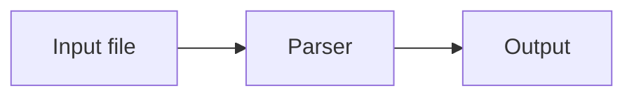

A good README.md answers five questions in order: what the project does, why it's useful, how to install it, how to use it, and how to get help or contribute. Write it in GitHub Flavored Markdown with a `#` title, short sections under `##` headings, fenced code blocks for commands, and a license line at the end.

That structure comes straight from GitHub's own guidance on [what a README should cover](https://docs.github.com/en/repositories/managing-your-repositorys-settings-and-features/customizing-your-repository/about-readmes). Below is the section-by-section cheat sheet, the GitHub-specific syntax worth knowing, and a complete template you can paste into a new repository.

## Where does GitHub look for a README?

GitHub checks three places, in this order: the `.github` folder, the repository root, then the `docs` folder. The first `README.md` it finds is shown on the repository's front page. A few other details from the same docs page are worth knowing:

- Content beyond **500 KiB** is truncated when the README is viewed on GitHub.
- GitHub builds an **outline** from your headings automatically, available from the icon in the file header. You don't need to maintain a manual table of contents for GitHub readers, although one helps on npm or PyPI.
- Use **relative links** (`docs/setup.md`, `./images/demo.png`) for files in the repo, so links keep working in clones and on other branches.

## What sections should a README include?

| Section | What it answers | Needed? |
|---|---|---|
| Title + one-line summary | What is this? | Always |
| Badges | Is it maintained, tested, licensed? | Optional |
| Description / features | Why should I care? | Always |
| Installation | How do I get it running? | Always for code |
| Usage | What does a first run look like? | Always |
| Configuration | What can I change? | If there are options |
| Contributing | How do I help? | Open source projects |
| License | Can I use this? | Always for public code |
| Support / contact | Where do I ask questions? | Recommended |

Order matters more than length. Someone landing on your repository decides within the first screen whether to keep reading, so the summary and a working install command should be visible without scrolling.

## How should each README section be written?

**Title and summary.** One `#` heading with the project name, then a single sentence. Avoid a second `#` anywhere else in the file; use `##` for sections so the outline nests correctly.

**Badges.** Badges are just Markdown images, usually from [Shields.io](https://shields.io/). A static badge follows the pattern `https://img.shields.io/badge/<label>-<message>-<color>`. Wrap a badge in a link to make it clickable: `[](LICENSE)`. Three or four badges is plenty.

**Installation.** Put every command in a fenced code block with a language tag (`bash`, `powershell`, `python`) so GitHub highlights it and readers get the copy button. One command per line, no `$` prompt characters, which break copy-paste. See [code blocks](/markdown-cheat-sheet/code-blocks) for the fence syntax.

**Usage.** Show the smallest working example and its output. A screenshot or GIF helps for UI projects; store it in the repo and reference it with a relative path.

**Contributing.** Two or three lines plus a link to `CONTRIBUTING.md` is enough. GitHub surfaces that file to contributors automatically.

**License.** State the license name and link to the `LICENSE` file. If you haven't picked one, [choosealicense.com](https://choosealicense.com/) compares the common options.

## Which GitHub Markdown features matter in a README?

GitHub renders several extensions beyond standard Markdown. These are the ones that earn their place in a README.

**Alerts.** A blockquote whose first line is `[!NOTE]`, `[!TIP]`, `[!IMPORTANT]`, `[!WARNING]` or `[!CAUTION]` renders as a coloured callout. GitHub's docs recommend limiting alerts to one or two per article, not placing them back to back, and note they can't be nested inside other elements ([GitHub Docs](https://docs.github.com/en/get-started/writing-on-github/getting-started-with-writing-and-formatting-on-github/basic-writing-and-formatting-syntax)). Save them for breaking changes and security notes.

**Collapsed sections.** The HTML `details` element with a `summary` line hides long content, such as a full configuration reference or a changelog, behind a click ([GitHub Docs](https://docs.github.com/en/get-started/writing-on-github/working-with-advanced-formatting/organizing-information-with-collapsed-sections)). Leave a blank line after the `summary` line or the Markdown inside won't render.

**Tables.** Good for options, environment variables and compatibility matrices. Keep cells short; long prose in tables is unreadable on mobile. The [Markdown table generator](/markdown-table-generator) saves you from aligning pipes by hand, and the [tables reference](/markdown-cheat-sheet/tables) covers alignment.

**Task lists.** `- [ ]` and `- [x]` render as checkboxes, which works well for a public roadmap.

**Mermaid diagrams.** A fenced block tagged `mermaid` renders as a diagram on GitHub ([GitHub Docs](https://docs.github.com/en/get-started/writing-on-github/working-with-advanced-formatting/creating-diagrams)). An architecture flowchart in ten lines of text beats a PNG that goes stale.

**Heading anchors.** Every heading gets an anchor automatically: lowercase, spaces become hyphens, punctuation removed. `## Getting Started` is linkable as `#getting-started`, which is how you build a manual table of contents.

## What is the README syntax quick reference?

| Element | Syntax |
|---|---|
| Section heading | `## Installation` |
| Bold / italic | `**bold**` / `*italic*` |
| Inline code | `` `npm test` `` |
| Link to a file in the repo | `[Guide](docs/guide.md)` |
| Link to a section | `[Usage](#usage)` |
| Image | `` |
| Badge | `[](link-url)` |
| Alert | `> [!WARNING]` then `> text` on the next line |
| Task item | `- [ ] Add Windows support` |
| Footnote | `Text[^1]` and `[^1]: Note.` |

For everything else, the full [Markdown cheat sheet](/markdown-cheat-sheet) covers standard syntax element by element.

## What does a complete README template look like?

Copy this into `README.md` and replace the placeholders. The outer fence uses four backticks so the code blocks inside stay intact.

````markdown
# Project Name

One sentence that says what this project does and who it's for.

[](LICENSE)
[](CHANGELOG.md)

## Features

- Does the main thing in one command
- Works offline
- Zero runtime dependencies

## Installation

```bash
npm install project-name
```

> [!NOTE]
> Requires Node.js 20 or later.

## Usage

```js
import { run } from 'project-name';

run({ input: 'notes.md' });
```

## Configuration

| Option | Default | Description |
|--------|---------|-------------|
| `input` | `README.md` | File to process |
| `output` | `dist/` | Where results are written |

<details>
<summary>All environment variables</summary>

| Variable | Purpose |
|----------|---------|
| `PROJECT_DEBUG` | Enables verbose logging |

</details>

## How it works



## Roadmap

- [x] Core conversion
- [ ] Watch mode
- [ ] Plugin API

## Contributing

Pull requests are welcome. Read [CONTRIBUTING.md](CONTRIBUTING.md) before opening one,
and open an issue first for large changes.

## License

[MIT](LICENSE) © Your Name
````

Delete any section that doesn't apply. An honest three-section README beats a template full of "TODO".

## What are the most common README mistakes?

1. **Absolute links to your own files.** `https://github.com/you/repo/blob/main/docs/x.md` breaks on forks and other branches. Use `docs/x.md`.
2. **Broken images after renaming folders.** Relative paths are case-sensitive on GitHub even if your local OS isn't. `Images/Demo.png` and `images/demo.png` are different files.
3. **Commands with prompts.** `$ npm install` copies the `$` too. Drop it.
4. **Alert overload.** Five warnings in a row train readers to skip all of them.
5. **No license line.** Without a license, default copyright applies, so others have no clear permission to use or modify your code.

## How do you share a README outside GitHub?

Clients, managers and reviewers often want a document rather than a repository link. Paste the README into MDTool's [Markdown to PDF converter](/markdown-to-pdf) and choose the GitHub theme. Tables, highlighted code and Mermaid diagrams come through, and the conversion runs in your browser, so private repository content isn't uploaded. The full walkthrough, including badges and diagrams, is in [GitHub README to PDF](/blog/github-readme-to-pdf).

## Frequently Asked Questions

**Q: What file name should a README use?**

Use `README.md` in the repository root. GitHub also checks the `.github` and `docs` folders, but the root is the convention every tool expects. The `.md` extension tells GitHub to render it as Markdown.

**Q: Do GitHub alerts work outside GitHub?**

Not everywhere. Alerts are a GitHub extension. Other renderers may show them as an ordinary blockquote with the literal `[!NOTE]` text, so keep the alert text meaningful on its own.

**Q: How long should a README be?**

Long enough to get a new user from zero to a working first run. Move deep reference material into a `docs` folder or a collapsed section. GitHub truncates README content beyond 500 KiB.

**Q: How do I add a table of contents to a README?**

GitHub generates an outline from your headings automatically. For a manual one, list links to heading anchors, such as `[Usage](#usage)`, where the anchor is the heading in lowercase with spaces replaced by hyphens.

**Q: Can I use HTML in a README.md?**

Yes, a limited set. GitHub supports elements like `details`, `summary` and `img` with width attributes, but strips scripts, styles and most attributes for security. Prefer Markdown syntax where it exists.
